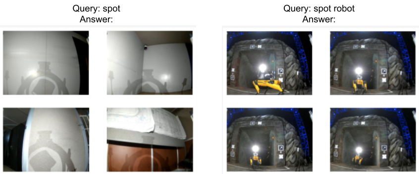
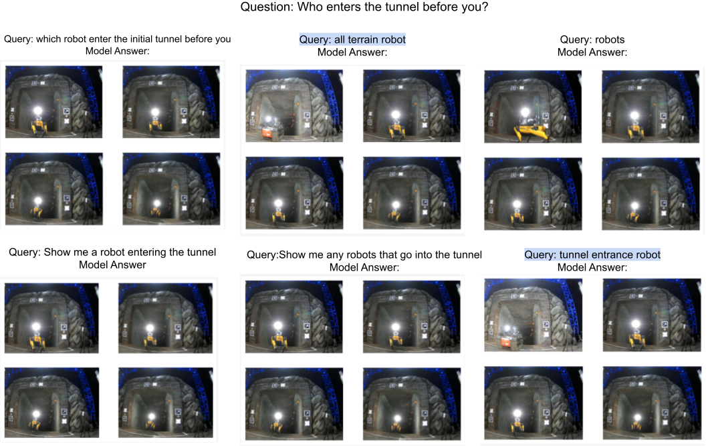

# ‘What did the Robot do in my Absence?’   Video Foundation Models to Enhance Intermittent Supervision

## [Kavindie Katuwandeniya](https://people.csiro.au/k/k/kavi-katuwandeniya), [Leimin Tian](https://tianleimin.github.io/), and [Dana Kulic](https://www.monash.edu/engineering/danakulic).

[Preprint can be found in arxiv.](https://arxiv.org/abs/2411.10016)

## Abstract
This paper investigates the use of Video
Foundation Models (ViFMs) for generating robot data summaries
to enhance intermittent human supervision of robot
teams. We propose a novel framework that produces both
generic and query-driven summaries of long-duration robot
vision data in three modalities: storyboards, short videos,
and text. Through a user study involving 30 participants, we
evaluate the efficacy of these summary methods in allowing
operators to accurately retrieve the observations and actions
that occurred while the robot was operating without supervision
over an extended duration (40 min). Our findings reveal that
query-driven summaries significantly improve retrieval accuracy
compared to generic summaries or raw data, albeit with
increased task duration. Storyboards are found to be the most
effective presentation modality, especially for object-related
queries. 

Fig. 1: Diagram of the proposed robot summary generation system. The system generates generic or query-driven summaries of long egocentric robot videos in the form of
storyboards, short videos, or text to help a user review the robots’ autonomous history.

### Video

<video controls>
  <source src="media/video_attachement.mp4" type="video/mp4">
Your browser does not support the video tag.
</video>

---

## Analysis of Cause of Errors
We compared the ground truth answer, model generated answer and the answer given by the user to further understand the cause of errors and inform future research.

### Assumptions for error analysis
Determining the correctness of the model's answers was not always straightforward. The model’s inaccuracies can stem from various factors, including the complexity of the query and the inherent limitations of the model itself. Below we present assumptions we adopted during the error analysis with illustrative examples.
1. Not querying the model.
	
	Some users did not explicitly query about some questions,  instead they watched the given raw video or just answered ‘Not sure’. In this case, we use NaN as the model answer to that question as the model did not generate an answer. 
	As a result, there are only 243 model answers for the Q condition instead of 270 (15 participants × 6 questions x 3 for each V, S and T tasks). 

2. Visual representation of the absence of an object.

	For questions where the ground truth answer was 0/No/No-one, when the summary modality is video or storyboard, since the number of video segments (K/k) or the number of images (M/m) were not changed dynamically, a summary video or a storyboard was always generated. However, this video/storyboard would not show any object/event instances since there were none in the raw video. In these cases, users can interpret the model output either as absence of an object, or as the model’s incapability - resulting in them saying 'Not sure’ as a potential answer.

3. Complex interplay between the user and the model and the ground truth.
	1. A mismatch between the correct answer and the answer provided by the model could be due to short-comings of the model or the query from the user. However, even if a user inputs a valid query and the model outputs a perfectly valid answer, it might not be enough to answer the question. For example, consider the following scenario in query-based summary via text modality (QT):
		- **Question to the user**: ‘In the first three-way junction you get inside the tunnel, which direction  do you choose to explore?’
		- **Query by the user**: ‘What time does the main junction with three separate tunnels appear in the video’
		- **Model Answer**: ‘The main junction with three separate tunnels appears in the video at night’
		- **User Answer**: ‘Not sure’
		- **Ground Truth Answer**: ‘Middle’

		The query is reasonable, where the user is trying to narrow down which part of the video they should pay attention to. The answer from the model is also appropriate, but not answering the user’s query in the way they intended. So, it becomes unclear where the overall incorrectness should be assigned to.

	2. Mismatch between the answer provided by the model and the answer provided by the user could occur because the users might not trust the answer from the model or users might misinterpret the answer. For example, consider the following scenario under QT, under the object type questions:
		- **Question to the user**: ‘What objects did you observe in the following list and how many of each? Blue Rope Bundle , Fire Extinguisher, Drill’
		- **Query by the user**: ‘how many fire extinguisher and drills in the video?’
		- **Model Answer**: ‘There are a total of two fire extinguishers and drills shown in the video’
		- **User Answer**: ‘Fire Extinguisher = 2, Drill = 2’
		- **Ground Truth Answer**: ‘Fire Extinguisher = >2, Drill = 2’

		The user has selected 2 for fire extinguisher and 2 for drills. This is one way to interpret what the model said.

To conduct the analysis, we make the following assumptions (note that G = general summary, Q = query-base summary; V = summary with video modality, S =  summary with story board modality, T = summary with text modality):

- We have excluded the C task, as there is no model (only 30 participants x 6 questions x  3 tasks = 540 data points). 
- Under V and S, if an object/event is not shown, we assume that there were no such objects or it did not happen. This is true to both G and Q conditions.
- With T, under G, if there is no mention of an object/event is not shown, we assume that there were no such objects or it did not happen.
- The ambiguity in T tense is ignored, eg: model answer `You will need to climb some stairs during the run’. ‘Yes’ was selected as the answer for the question ‘Do you climb any stairs during the run?’.
- Under QT some examples of the calls we make:
	1. Query: how many fire extinguisher and drills in the video?.
		- **Answer**: There are a total of two fire extinguishers and drills shown in the video.
		- **Decision**: Fire extinguishers = ‘Not sure’, Drills = ‘Not sure’
	2. Query: What time does the main junction with three seperate tunnels appear in the video.
		- **Answer**: The main junction with three separate tunnels appears in the video at night.
		- **Decision**: Use ‘Not sure’ to answer `In the first three-way junction you get inside the tunnel, which direction do you choose to explore?.'

### Error analysis results
Based on the above assumptions, the summary statistics in the following table is derived, where the percentage accuracy is shown (GT = Ground truth).

| Model Answer = GT Answer (513 data points) | User Answer = Model Answer (513 data points) | User Answer = GT Answer (540 data points) |
|:--------------------------------------------------------:|:------------------------------------------------:|:-------------------------------------------------------:|
|                           63.0%                          |                       61.8%                      |                          46.5%                          |

The models demonstrated an average 63.0 % accuracy rate. Without any AI assistance, users demonstrated an overall accuracy of 43.3 %. With assistance, the overall task accuracy of the users was 46.5 %, but varied across summarisation type and modality (see Tab. II of the paper).

## Examples
### Limitations of current ViFMS
Without any domain specific understanding, ViFMs have general understanding. For example under QS, when the query is `spot' , the model produces images of spots (a small round or roundish mark) which is a general meaning, while ‘spot robot’ selects the robot images.

### Challenges with free-form querying
Different queries generated by users to retrieve information to answer the question `Who enters the tunnel before you? ' under QS (correct answer 1 Spot and 1 ATR) and the different results produced by the model is given in the following figure. 

4 images produced by the model (Model Answer) under QS task is shown below for 6 different user queries (Query). The correct answer is produced by the 2 queries highlighted in light blue: **all terrain robot** and **tunnel entrance robot**.

